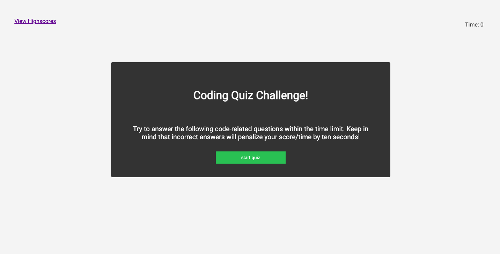

# 04 Code Quiz

## Depolyed Application

View the depolyed application here ----> [Code-Quiz](https://lone1ne.github.io/Code-Quiz/)

## Description

The Code Quiz is a web application to test your knowledge on JavaScript fundamentals. You will be presented with a series of questions and multiple-choice answers.

Each correct answer will increase your score, while each incorrect answer will take 10 seconds from the clock. Once all questions have been answered or time runs out, the game is over. At this point, you can save your score with your initials, which will be displayed on the highscores page.

## User Story

```
AS A coding boot camp student
I WANT to take a timed quiz on JavaScript fundamentals that stores high scores
SO THAT I can gauge my progress compared to my peers
```

## Acceptance Criteria

```
GIVEN I am taking a code quiz
WHEN I click the start button
THEN a timer starts and I am presented with a question
WHEN I answer a question
THEN I am presented with another question
WHEN I answer a question incorrectly
THEN time is subtracted from the clock
WHEN all questions are answered or the timer reaches 0
THEN the game is over
WHEN the game is over
THEN I can save my initials and score
```

## Mock-Up

The following image shows the web application's appearance:


